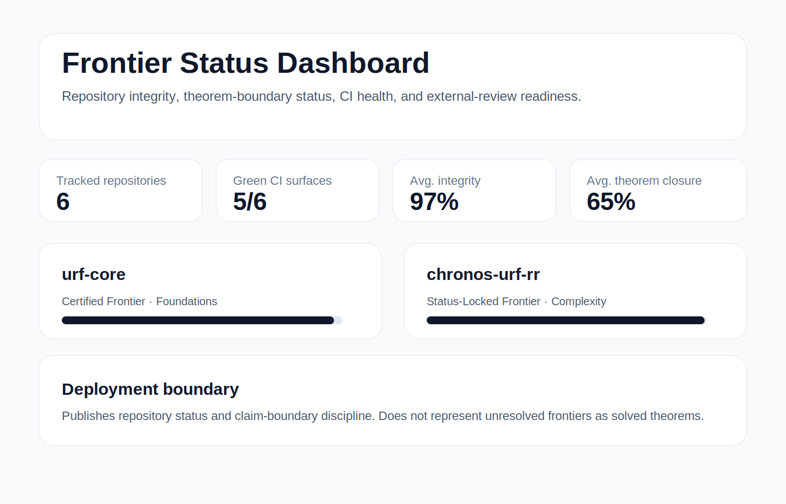

# Frontier Status Dashboard

Public product surface for tracking repository integrity, CI health, theorem-boundary status, proof-hole visibility, and external-review readiness across the Vasquez Research program.



## Product value

This dashboard turns a distributed research-program surface into a single commercial-facing artifact:

- repository status visibility
- theorem-boundary discipline
- CI/test/build credibility
- proof-hole and conditional-frontier separation
- external-review readiness

## Deployment boundary

This product publishes repository status, CI health, proof-hole visibility, and claim-boundary discipline.

It does not represent unresolved mathematical frontiers as solved theorems.

## Commands

```bash
npm ci
npm run test
npm run build
Optional repository-data ingestion
GITHUB_TOKEN="$(gh auth token)" npm run ingest
npm run test
npm run build
Deploy
npm install -g vercel
vercel --prod
Repository
https://github.com/inaciovasquez2020/frontier-status-dashboard
